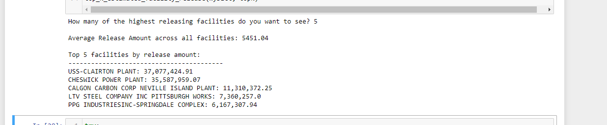

# Dictionary Summary Analysis
This program is given a file on toxic chemicals released into the air by various facilities and it builds a summary analysis of this data.
It provides the user with the option to see a print out of the facilities releasing the highest amount of chemicals.

## Screen shot of program running

## Source of Data
You can find this dataset and more [here](https://data.wprdc.org/dataset/toxic-release-inventory).
