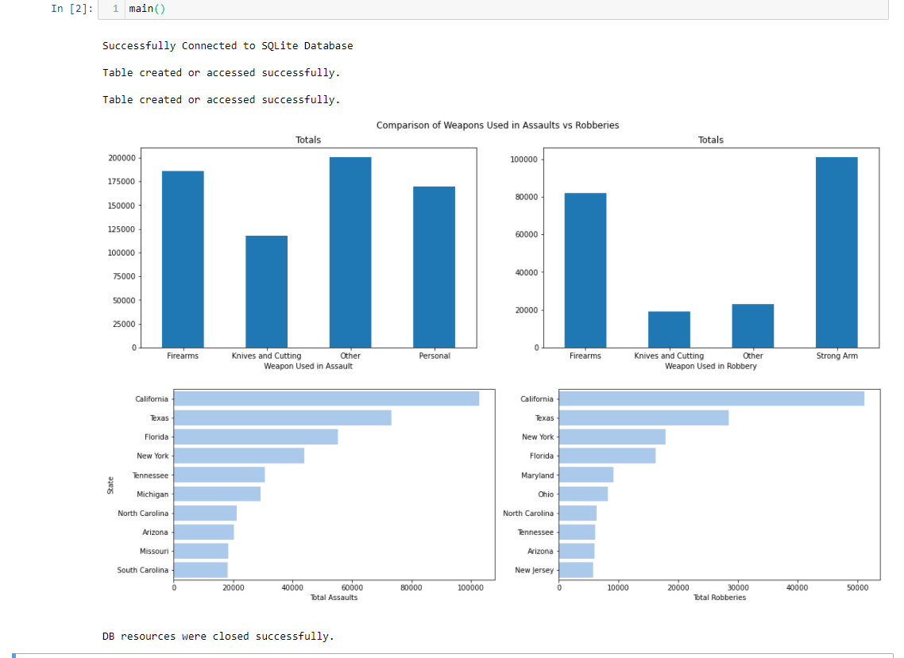

# FBI Crime Statistic Comparison Program
This program compares the 2019 FBI statistics on Aggravated Assaults to Robberies based on Weapon Type.  This is accomplished by first scraping the FBI crime data from tables on their website.  Once this data is scraped, it is then written into a SQL database using SQLite.  The program then uses SQL to total the number of incidents for each type of weapon tracked in each table.  (I.E. Count how many robberies involved a firearm and how many assaults involved a knife.)

Once these weapon type totals are obtained, the program then uses Pandas to visualize the breakdown of assaults and robberies across the various weapon types.  The result is two column charts, one for assaults and one for robberies, that categorize the total number of assaults and robberies based on weapon type involved.  This allows the end users to see what proportion of the total number of crimes does each weapon type make up.

Lastly, the program also uses SQL to obtain the top 10 states with the highest amount of assaults and the top 10 with the highest amount of robberies.  It then uses Seaborn to visualize this data into a horizontal bar plot.

## Program Output

