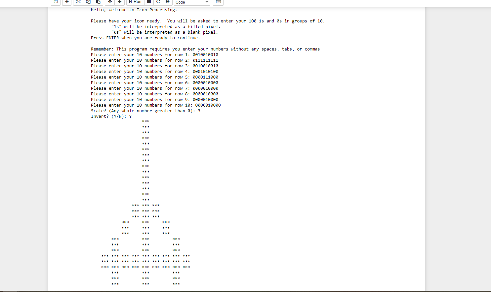

# Icon Printing Program
This program prompts the user to enter 100 integers of either 1 or 0 and then converts these into a picture in a 10x10 grid.
1 represents a filled or on pixel and 0 represents a blank or off pixel.
The user also has the option to scale up the picture to make it larger or invert it to flip it upside down.

## Sample Screen Shots
### Regular, Non-Scaled Image

### Scaled and Inverted Image

