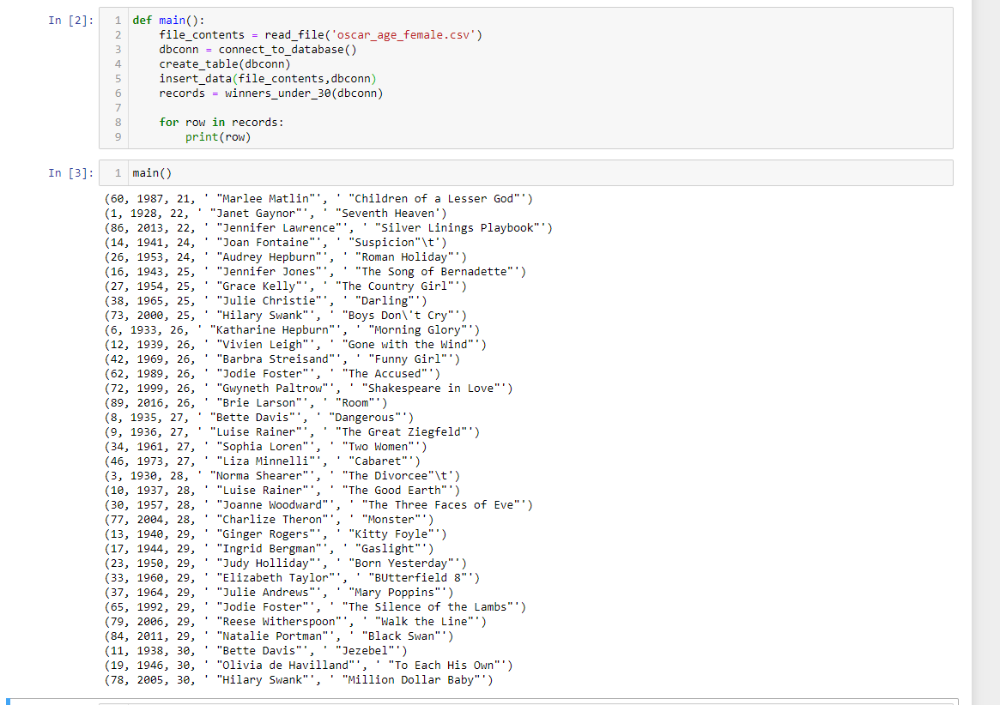

# SQLite Database Program
This program reads in a csv file of female oscar winners with their ages, year they won, and what movie they starred in.
It then returns a list of rows for those winners who are 30 years of age or younger.

## Sample Screen Shot

## Considerations for improvment
If improved I would like to change the output into that of a dataframe using Pandas for better appearance.
I would also like to add some error handling to avoid issues with running the program after an inital run.  Once the table has had data inserted into it, without error handling, trying to insert the data again with the same id numbers would break the primary key constraint and cause an error.  I would like to write error handling to account for this and bypass the insertions if that were the case.

### Notes about work process
I had to alter the original file slightly before saving it and reading it into the program.  There was an extra column to the far right of the table that was blank for all but two rows.  The values contained in the non-null rows were part of the movie title and for some reason had been split across two colums instead of contained within one.  I simply edited the data to concatenate these values together and create the full movie title in the appropriate column and then discarded the extra column from the far right.
