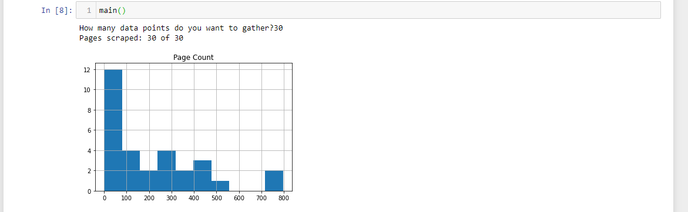

# Web Scraping Program
This program uses Beautiful Soup to parse out HTML code requested from Goodreads.com and then extracts various data points from each webpage.  Each webpage equates to a given book.
For the sake of simplicity, the program in it's current state only scrapes the page count of the different books it gets.  Books are chosen at random thanks to a random number
generator that is used in the URL as the search ID.  The user is prompted to input how many pages (data points) they want to gather.  The program keeps making requests until
it gets a valid webpages equal in number to what the user input.  After scraping the page counts of books, it then displays the frequency of page counts in a Histogram.

## Sample Output

